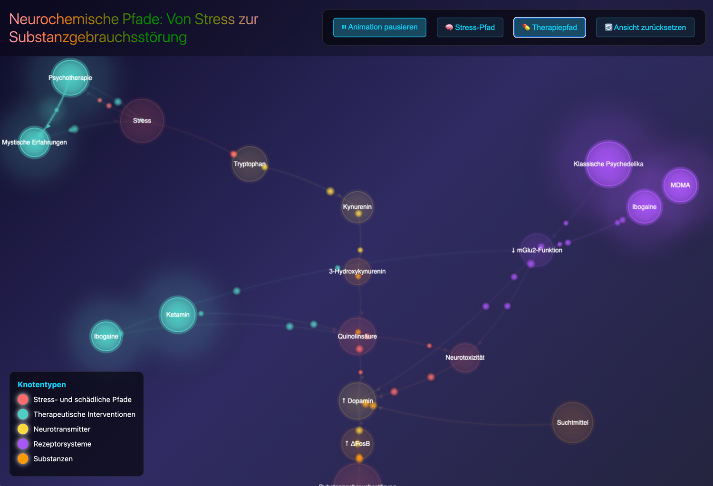

# 🧠 Neuronale Signalweg-Visualisierung: Von Stress zur Sucht

Eine interaktive Visualisierung der neurobiologischen Signalwege, die chronischen Stress mit Substanzgebrauchsstörungen verbinden, einschließlich therapeutischer Interventionspunkte.

**[🚀 Live Demo](https://darealone.github.io/Visualisierung-neuronaler-Bahnen)**

[🇩🇪 German Version](README.md)


*Interaktives neuronales Netzwerk mit biochemischen Kaskaden und Interventionspunkten*

## 📖 Überblick

Dieses Projekt visualisiert die komplexe biochemische Kaskade, die psychologischen Stress über den Kynurenin-Stoffwechselweg mit Sucht verbindet. Es veranschaulicht, wie chronischer Stress zu Neurotoxizität und letztendlich zu Substanzgebrauchsstörungen führen kann, und zeigt gleichzeitig auf, wo therapeutische Interventionen diese schädlichen Prozesse unterbrechen können.

## ✨ Funktionen

### Interaktive Elemente
- **🔍 Klicken zum Erkunden**: Klicken Sie auf jeden Knotenpunkt für detaillierte wissenschaftliche Informationen
- **⚡ Animierte Pfade**: Beobachten Sie Partikel, die in Echtzeit durch neuronale Verbindungen fließen
- **🎯 Pfad-Hervorhebung**: Filtern Sie Ansichten, um sich auf Stress-Pfade oder therapeutische Interventionen zu konzentrieren
- **💫 Dynamische Visualisierung**: Knotenpunkte pulsieren und leuchten für ein fesselndes Lernerlebnis

### Dargestellte wissenschaftliche Pfade
- **Stress → Kynurenin-Stoffwechselweg**: Die Hauptkaskade von psychologischem Stress über den Tryptophan-Metabolismus
- **Neurotoxischer Zweig**: Wie Chinolinsäure (NMDA-Agonist) Exzitotoxizität verursacht
- **Dopamin-Dysregulation**: Der Konvergenzpunkt für Suchtmittel
- **Therapeutische Interventionen**: Mehrere Interventionspunkte einschließlich:
  - Psychotherapie und mystische Erfahrungen
  - Ketamin (NMDA-Antagonist)
  - Psychedelika (5-HT2A-Agonisten)
  - Ibogain (Multi-Rezeptor-Aktivität)

## 🔬 Wissenschaftlicher Hintergrund

### Der Kynurenin-Stoffwechselweg
Unter Stress verschiebt sich der Tryptophan-Metabolismus weg von der Serotonin-Produktion hin zum Kynurenin-Stoffwechselweg. Dies produziert mehrere neuroaktive Metaboliten, einschließlich der neurotoxischen Chinolinsäure, die als NMDA-Rezeptor-Agonist wirkt und verursacht:
- Glutamat-Exzitotoxizität
- Neuroinflammation
- HPA-Achsen-Dysregulation
- Veränderte Dopamin-Signalübertragung

### Therapeutische Mechanismen
Die Visualisierung zeigt, wie verschiedene Interventionen wirken:
- **Ketamin**: Blockiert NMDA-Rezeptoren und wirkt der Chinolinsäure entgegen
- **Psychedelika**: Reduzieren die mGlu2-Rezeptorfunktion und fördern Neuroplastizität
- **Psychotherapie**: Behandelt die Wurzel von Stress und Trauma
- **Ibogain**: Multimodale Wirkung einschließlich anti-süchtiger Eigenschaften

## 💻 Technische Details

### Entwickelt mit
- **HTML5 Canvas**: Für flüssige, hardware-beschleunigte Grafiken
- **Vanilla JavaScript**: Keine Abhängigkeiten, pure Leistung
- **CSS3**: Moderne Verläufe und Animationen

### Eigenschaften
- Responsives Design passt sich an jede Bildschirmgröße an
- Partikelsystem zur Pfad-Visualisierung
- Echtzeit-Knoteninteraktion und -Hervorhebung
- Flüssige Animationen mit 60 FPS

## 🚀 Verwendung

### Schnellstart
1. Klonen Sie dieses Repository:
   ```bash
   git clone https://github.com/darealone/neural-pathway-visualization.git
   ```
2. Öffnen Sie `index.html` in einem modernen Webbrowser
3. Kein Build-Prozess oder Abhängigkeiten erforderlich!

### Hosting
Dieses Projekt ist für GitHub Pages konzipiert:
1. Forken Sie dieses Repository
2. Gehen Sie zu Einstellungen → Pages
3. Aktivieren Sie GitHub Pages vom Hauptzweig
4. Ihre Visualisierung ist live unter `https://darealone.github.io/neural-pathway-visualization/`

## 🎯 Anwendungsfälle

### Bildung
- **Neurowissenschaftliche Ausbildung**: Lehre der Biochemie von Stress und Sucht
- **Medizinische Ausbildung**: Verständnis von Interventionspunkten für die Behandlung
- **Öffentliche Gesundheit**: Kommunikation der Wissenschaft der Sucht als Gehirnerkrankung

### Forschungskommunikation
- **Konferenzpräsentationen**: Interaktive Alternative zu statischen Folien
- **Förderanträge**: Visualisierung von Forschungsschwerpunkten
- **Öffentlichkeitsarbeit**: Zugänglichmachen komplexer Neurowissenschaft

### Klinische Anwendungen
- **Patientenaufklärung**: Patienten helfen, ihren Zustand zu verstehen
- **Behandlungsplanung**: Identifizierung von Interventionsstrategien
- **Schulung**: Vermittlung therapeutischer Wirkmechanismen

## 📊 Datenquellen

Die gezeigten Pfade und Verbindungen basieren auf aktueller neurowissenschaftlicher Forschung, einschließlich:
- Studien zum Kynurenin-Stoffwechselweg
- NMDA-Rezeptor- und Exzitotoxizitätsforschung
- Mechanismen der psychedelischen Therapie
- Literatur zur Neurobiologie der Sucht

## 🤝 Mitwirkung

Beiträge sind willkommen! Gerne können Sie:
- Issues für Fehler oder Vorschläge einreichen
- Pull Requests mit Verbesserungen erstellen
- Forken und für Ihre eigene Forschung anpassen
- Feedback zur Visualisierung teilen

## 📄 Lizenz

Dieses Projekt ist Open Source und verfügbar unter der [MIT-Lizenz](LICENSE).

## 🙏 Danksagungen

- Inspiriert von jüngsten Fortschritten in der psychedelischen Therapieforschung
- Basierend auf konvergierenden Erkenntnissen aus Neurowissenschaft und Psychiatrie
- Erstellt, um die Lücke zwischen komplexer Wissenschaft und öffentlichem Verständnis zu überbrücken

## 📬 Kontakt

- GitHub: [@darealone](https://github.com/darealone)
- LinkedIn: [Al Hashemi](https://www.linkedin.com/in/al-hashemi/)
- Projekt-Link: [https://github.com/darealone/neural-pathway-visualization](https://github.com/darealone/neural-pathway-visualization)

## 🔗 Weiterführende Ressourcen

- [Kynurenin-Stoffwechselweg - Wikipedia](https://de.wikipedia.org/wiki/Kynurenin)
- [MAPS - Psychedelische Forschung](https://maps.org/)
- [Die Biologie der Sucht - NIH](https://www.drugabuse.gov/publications/drugs-brains-behavior-science-addiction)

---

**Hinweis**: Diese Visualisierung dient Bildungszwecken. Wenn Sie oder jemand, den Sie kennen, mit Substanzgebrauch kämpft, suchen Sie bitte professionelle Hilfe.

## 🏷️ Schlüsselwörter

`Neurowissenschaft` `Sucht` `Stress` `Kynurenin` `Psychedelika` `Therapie` `Visualisierung` `Interaktiv` `Bildung` `Psychische-Gesundheit` `Biochemie` `NMDA` `Dopamin` `Serotonin` `Datenvisualisierung`
